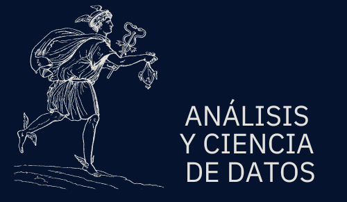

<html lang="es">
<head>
    <meta charset="UTF-8">
    <meta name="viewport" content="width=device-width, initial-scale=1.0">
    <title>Juan Luis Cortés Cervantes| Científico de Datos </title>
    <link rel="preconnect" href="https://fonts.googleapis.com">
    <link rel="preconnect" href="https://fonts.gstatic.com" crossorigin>
    <link href="https://fonts.googleapis.com/css2?family=Inter:wght@300;400;600;700&display=swap" rel="stylesheet">
    <link rel="stylesheet" href="style.css">
    <link rel="icon" href="images/logo.png" type="image/png">
    <!-- FontAwesome for icons -->
    <link rel="stylesheet" href="https://cdnjs.cloudflare.com/ajax/libs/font-awesome/6.4.0/css/all.min.css">
</head>
<body>
    <nav class="navbar">
        

            
            

                <a href="about.md">Sobre mí</a>
                <a href="projects.md">Projectos</a>
                <a href="contact.md">Contacto</a>
                
                <a href="https://www.linkedin.com/in/juan-luis-cortés-cervantes/" target="_blank" class="nav-social" title="LinkedIn"><i class="fa-brands fa-linkedin"></i></a>
                <a href="https://github.com/juanluiscc-gif" target="_blank" class="nav-social" title="GitHub"><i class="fa-brands fa-github"></i></a>
                <a href="mailto:juanluiscortescervantes@gmail.com" class="nav-social" title="Email"><i class="fa-solid fa-envelope"></i></a>
            

        

    </nav>
 <section class="hero">
        

            
            <h1>Juan Luis Cortés Cervantes</h1>
            <h2>Científico de Datos</h2>
            
La ciencia al servicio de la humanidad.

            

                <a href="projects.md" class="btn btn-primary">Ver Proyectos</a>
                <a href="utils/Juan Cortés CV.pdf" download class="btn btn-secondary">Descargar CV</a>
            

        

    </section>

<header class="hero">
  

    <h1>Juan Luis Cortés Cervantes (juanluiscc-gif)</h1>
    
Científico de Datos • Proyectos & Portafolio

    <nav class="hero-nav">
      <a href="#proyectos">Proyectos</a>
      <a href="#sobre-mi">Sobre mí</a>
      <a href="#contacto">Contacto</a>
    </nav>
  

</header>

<footer>
        

            
&copy; 2025 Juan Luis Cortés Cervantes. Todos los derechos reservados.

        

    </footer>

</body>
</html>